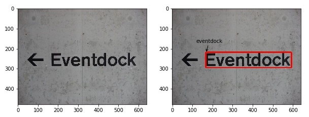

# keras-ocr
This is a slightly polished and packaged version of the [Keras OCR example](https://github.com/keras-team/keras/blob/master/examples/image_ocr.py) and the published [CRAFT text detection model](https://github.com/clovaai/CRAFT-pytorch). It provides a high level API for training a text detection and OCR pipeline.

## Getting Started

### Installation
You must have the [Cairo library](https://cairographics.org/) installed to use the built in image generator. Then you can install the package.


```bash
# To install from master
pip install git+https://github.com/faustomorales/keras-ocr.git#egg=keras-ocr

# To install from PyPi
pip install keras-ocr
```

### Using

#### Using pretrained text detection model
The package ships with an easy-to-use implementation of the CRAFT text detection model with the original weights.

```python
import matplotlib.pyplot as plt

import keras_ocr

detector = keras_ocr.detection.Detector(pretrained=True)
image = keras_ocr.tools.read('tests/test_image.jpg')

# Boxes will be an Nx4x2 array of box quadrangles
# where N is the number of detected text boxes.
boxes = detector.detect(images=[image])[0]
canvas = keras_ocr.detection.drawBoxes(image, boxes)
plt.imshow(canvas)
```



#### Complete end-to-end training
You may wish to train your own end-to-end OCR pipeline. Here's an example for how you might do it. Note that the image generator has many options not documented here (such as adding backgrounds and image augmentation). Check the documentation for the `keras_ocr.tools.get_image_generator` function for more details.

Please note that, right now, we use a very simple training mechanism for the text detector which seems to work but does not match the method used in the original implementation.

```python
import string

import keras_ocr

# The alphabet defines which characters
# the OCR will be trained to detect.
alphabet = string.digits + \
           string.ascii_lowercase + \
           string.ascii_uppercase + \
           string.punctuation + ' '

# Build the text detector (pretrained)
detector = keras_ocr.detection.Detector(pretrained=True)
detector.model.compile(
    loss='mse',
    optimizer='adam'
)

# Build the recognizer (randomly initialized)
# and build the training model.
recognizer = keras_ocr.recognition.Recognizer(
    alphabet=alphabet,
    width=128,
    height=64
)
recognizer.create_training_model(max_string_length=16)

# For each text sample, the text generator provides
# a list of (category, string) tuples. The category
# is used to select which fonts the image generator
# should choose from when rendering those characters 
# (see the image generator step below) this is useful
# for cases where you have characters that are only
# available in some fonts. You can replace this with
# your own generator, just be sure to match
# that function signature if you are using
# recognizer.get_image_generator. Alternatively,
# you can provide your own image_generator altogether.
# The default text generator uses the DocumentGenerator
# from essential-generators.
detection_text_generator = keras_ocr.get_text_generator(
    max_string_length=32,
    alphabet=alphabet
)

# The image generator generates (image, sentence, lines)
# tuples where image is a HxWx3 image, 
# sentence is a string using only letters
# from the selected alphabet, and lines is a list of
# lines of text in the image where each line is a list of 
# tuples of the form (x1, y1, x2, y2, x3, y3, y4, c). c
# is the character in the line and (x1, y2), (x2, y2), (x3, y3),
# (x4, y4) define the bounding coordinates in clockwise order
# starting from the top left. You can replace
# this with your own generator, just be sure to match
# that function signature.
detection_image_generator = keras_ocr.tools.get_image_generator(
    height=256,
    width=256,
    x_start=(10, 30),
    y_start=(10, 30),
    single_line=False,
    text_generator=detection_text_generator
    font_groups={
        'characters': [
            'Century Schoolbook',
            'Courier',
            'STIX',
            'URW Chancery L',
            'FreeMono'
        ]
    }
)

# From our image generator, create a training batch generator
# and train the model.
detection_batch_generator = detector.get_batch_generator(
    image_generator=detection_image_generator,
    batch_size=2,
)
detector.model.fit_generator(
  generator=detection_batch_generator,
  steps_per_epoch=100,
  epochs=10,
  workers=0
)
detector.model.save_weights('v0_detector.h5')

# This next part is similar to before but now
# we adjust the image generator to provide only
# single lines of text.
recognition_image_generator = keras_ocr.tools.convert_multiline_generator_to_single_line(
    multiline_generator=detection_image_generator,
    max_string_length=recognizer.training_model.input_shape[1][1],
    target_width=recognizer.model.input_shape[2],
    target_height=recognizer.model.input_shape[1]
)
recognition_batch_generator = recognizer.get_batch_generator(
    image_generator=recognition_image_generator,
    batch_size=8
)
recognizer.training_model.fit_generator(
    generator=recognition_batch_generator,
    steps_per_epoch=100,
    epochs=100
)

# You can save the model weights to use later.
recognizer.model.save_weights('v0_recognizer.h5')

# Once training is done, you can use recognize
# to extract text.
image, _, _ = next(detection_image_generator)
boxes = detector.detect(images=[image])[0]
predictions = recognizer.recognize_from_boxes(boxes=boxes, image=image)
print(predictions)
```